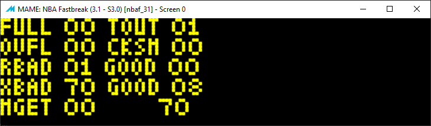

NBAF Linked Game - Serial Notes
===============================

`wpc-serial-nbaf-linkedgame-notes.md`

### Linked Game Serial Debug Display



##### Flipper Codes to turn on DEBUG DISPLAY
```
14R + 1L + 5R + 1L + 20R + 1L, Diag screen (attract mode)
```
##### Flipper Codes to turn off DEBUG DISPLAY
```
7R + 1L + 1R + 1L + 7R + 1L, Credits (attract mode)
```

#### Debug Display RAM variables

| RAM address   | Variable name                 |
|---------------|-------------------------------|
| `0x7e8`       | serialDebug_Count_FULL
| `0x7e9`       | serialDebug_Count_TOUT
| `0x7ea`       | serialDebug_Count_OVFL
| `0x7eb`       | serialDebug_Count_CKSM
| `0x7ec`       | serialDebug_Count_MGET
| `0x7ed`       | serialDebug_Count_RBAD
| `0x7ee`       | serialDebug_Count_RGOOD
| `0x7ef`       | serialDebug_Count_BAD_Total
| `0x7f0`       | serialDebug_Count_XBAD
| `0x7f1`       | serialDebug_Count_XGOOD


### Linked Game Attract Mode Display
When an NBA Fastbreak is linked with another machine and ready for linked play, the attract mode sequence will show the following *Championship Link* banner after showing the game name banner.


##### OTHER Flipper Code for NBAF

```
NBAFB 3.1:
23R + 1L + 1R + 1L + 7R + 1L
5R + 1L + 1R + 1L + 5R + 1L
4R + 1L + 1R + 1L + 20R + 1L, Time/Date (attract mode)
19R + 1L + 20R + 1L + 17R + 1L, Menu Sound Effect, but nothing happens?! (attract mode)
14R + 1L + 2R + 1L + 1R + 1L, Menu Sound Effect, but nothing happens?! (attract mode)
10R + 1L + 14R + 1L + 21R + 1L, Happy Birthday Joel (attract mode)
```


### BUFFERS processed by Syshook4 / ISRSerialProcessing
```
0x663 -> 1st two bytes test for ZERO
	0x663 + 0x15 (dec: 21) = 0x678 -> two bytes test for ZERO
	0x663 + 0x1D (dec: 29) = 0x680 
```

```
0x680 -> 1st two bytes test for ZERO
	...
	0x680 + 0x1D (dec: 29) = 0x69D 
```

```
0x69D -> 1st two bytes test for ZERO
	...
	0x69D + 0x1D (dec: 29) = 0x6BA 
```

```
0x6BA -> 1st two bytes test for ZERO
	...
	0x6BA + 0x1D (dec: 29) = 0x6D7 
```

```
0x6D7 -> 1st two bytes test for ZERO
	...
	0x6D7 + 0x1D (dec: 29) = 0x6F4 
```

```
0x6F4 -> 1st two bytes test for ZERO
	...
	0x6F4 + 0x1D (dec: 29) = 0x711 
```

```
0x711 -> 1st two bytes test for ZERO TRUE -> RTI
```


### Linked Game Communications Buffer(s)
* 8 total buffers in a linked list - length: 0x17 decimal: 23 bytes each 
* length: 0x17 (decimal: 23 bytes) 

0) `$089e`  len: 0x17
1) `$0887`  len: 0x17
2) `$0870`  len: 0x17
3) `$0859`  len: 0x17
4) `$0842`  len: 0x17
5) `$0828`  len: 0x17
6) `$0814`  len: 0x17
7) `$07fd`  len: 0x17

```
;---------------------------------------------------------
SysHook_04:
;
;   calls:
;       bnk_32_4b4f
l       bnk_32_7a7c
;       bnk_37_6848
;       bnk_39_6db2
;       readSerialBufferCharacter_into_A
;       bnk_3a_7e58
;       sys_c041
;
;   references:
;       $6F
;       $81
;       $CE
;       $D6 (tested against value $19)
;       currentSerial_counter_00_3b
;       
;       $053A
;       $05AB
;       $05B4
;       $065D
;       $065E
;       
;       ram_serialLink_773  
;       ram_serialLink_784  
;       ram_serialLink_78b  
;       $078F
;       $0796
;       
;       ram_serialDebug_Count_RGOOD
;       ram_serialDebug_Count_MGET
;       ram_serialDebug_Count_TOUT
;       ram_serialDebug_Count_OVFL
;       ram_serialDebug_Count_CKSM
;       ram_serialDebug_Count_RBAD
;       
;       serialLink_next_buffer AKA ram_serialLink_7f2  
;       ram_serialLink_7f4  
;       ram_serialLink_7f6  
;       serialLink_checksum AKA ram_serialLink_7f8
;       ram_serialLink_7f9  
;       
;       $1704
;       $1708
;---------------------------------------------------------
E854: 7d 17 04           TST   $1704
E857: 27 16              BEQ   $E86F

E859: 7d 07 84           TST  ram_serialLink_784  
E85C: 27 06              BEQ   $E864

E85E: bd 89 f0           JSR_BANK( bnk_32_7a7c )
E861: 7a 7c 32
E864: 7d 07 8b           TST  ram_serialLink_78b  
E867: 27 06              BEQ   $E86F

E869: bd 89 f0           JSR_BANK( bnk_37_6848 )
E86C: 68 48 37
E86F: 96 cd              LDA  currentSerial_counter_00_3b
E871: 4c                 INCA  
E872: 81 3c              CMPA  #$3C                     ; counter-boundary decimal: 60
E874: 2c 04              BGE   $E87A

E876: 97 cd              STA  currentSerial_counter_00_3b
E878: 20 3f              BRA  serialTests               ; $E8B9

E87A: 0f cd              CLR  currentSerial_counter_00_3b
E87C: b6 05 ab           LDA   $05AB
E87F: 27 04              BEQ   $E885

E881: 4a                 DECA  
E882: b7 05 ab           STA   $05AB
E885: 7d 17 04           TST   $1704
E888: 26 1d              BNE   $E8A7

E88A: b6 07 73           LDA  ram_serialLink_773  
E88D: 4a                 DECA  
E88E: b7 07 73           STA  ram_serialLink_773  
E891: 2a 14              BPL   $E8A7

E893: 86 0a              LDA   #$0A
E895: b7 07 73           STA  ram_serialLink_773  
E898: 0f d8              CLR   $D8
E89A: bd 89 f0           JSR_BANK( bnk_39_6DB2 )
E89D: 6d b2 39
E8A0: 25 02              BCS   $E8A4

E8A2: 0c d8              INC   $D8

E8A4: 7f 02 d8           CLR   $02D8

E8A7: 7d 17 04           TST   $1704
E8AA: 26 0d              BNE   serialTests               ; $E8B9

E8AC: 0d 81              TST   $81
E8AE: 26 09              BNE   serialTests               ; $E8B9

E8B0: 96 ce              LDA   $CE
E8B2: 27 05              BEQ   serialTests               ; $E8B9

E8B4: 4a                 DECA  
E8B5: 97 ce              STA   $CE
E8B7: 26 00              BNE   serialTests               ; $E8B9 NULL branch

                    serialTests:
E8B9: b6 05 3a           LDA   $053A
E8BC: 27 03              BEQ   $E8C1

E8BE: 7f 05 3a           CLR   $053A

E8C1: 7d 07 f9           TST  serialLink_counter_0f_00  
E8C4: 27 07              BEQ   :readBuffer

E8C6: 7a 07 f9           DEC  serialLink_counter_0f_00  
E8C9: 10 27 00 94        LBEQ  :rbad_TOUT

                    :readBuffer
E8CD: bd 89 f0           JSR_BANK( readSerialBufferCharacter_into_A )
E8D0: 68 dc 39
E8D3: 10 25 00 b8        LBCS  :testflag_5b4        ; $E98F

E8D7: be 07 f6           LDX  ram_serialLink_7f6
E8DA: 26 2b              BNE   $E907

E8DC: 34 41              PSHS  CC,U                     ; SAVE CC, U
E8DE: 1a 10              ORCC  #$10                     ; SET INTERRUPT
E8E0: be 07 f2           LDX   serialLink_next_buffer   ; block or process pointer?
E8E3: 27 0f              BEQ   :clearInterruptSetCarry  ; $E8F4
;
E8E5: ee 84              LDU   ,X                       ; pointer to next block or process? 
E8E7: ff 07 f2           STU  serialLink_next_buffer    ; save it as current
E8EA: 6f 84              CLR   ,X                       ; clear chain ref to prev block HI
E8EC: 6f 01              CLR   $1,X                     ; clear chain ref to prev block LO
E8EE: 35 41              PULS  CC,U                     ; CLEAR INTERRUPT restore CC, U
E8F0: 1c fe              ANDCC #$FE                     ; CLEAR CARRY
E8F2: 20 04              BRA   :checkCarry              ; $E8F8
;
                    :clearInterruptSetCarry
E8F4: 35 41              PULS  CC,U                     ; CLEAR INTERRUPT restore CC, U
E8F6: 1a 01              ORCC  #$01                     ; SET CARRY
;
                    :checkCarry
E8F8: 10 25 00 93        LBCS  :testflag_5b4            ; $E98F

E8FC: bf 07 f6           STX  ram_serialLink_7f6        ; save orig from                 
                                                        ;   serialLink_next_buffer->7f6 
E8FF: 7f 07 f8           CLR  serialLink_checksum       ; clear checksum for new buf
E902: c6 0f              LDB   #$0F                     ; init counter to decimal 15
E904: f7 07 f9           STB  serialLink_counter_0f_00  

E907: 33 03              LEAU  $3,X                     ; U gets destbuf 
E909: e6 02              LDB   $2,X                     ; B gets bufindex value
E90B: c1 14              CMPB  #$14                     ; if B >= dec 20... 
E90D: 10 2c 00 56        LBGE  :rbad_OVFL               ; ...then BUFOVERFLOW $E967

E911: a7 c5              STA   B,U                      ; save char from serialbuf->destbuf
E913: 5c                 INCB                           ; inc bufindex...
E914: e7 02              STB   $2,X                     ; ...and save it 
E916: c1 09              CMPB  #$09                     ; if bufindex < 9
E918: 2d 06              BLT   :bufIndexLowValue        ; $E920 

                    :bufIndexHiValue
E91A: c0 09              SUBB  #$09                     ; B=(B minus 9)
E91C: e1 0b              CMPB  $B,X                     ; if B >= block+11
E91E: 2c 08              BGE   :bufReadComplete         ; ...$E928
                    
                    :bufIndexLowValue
E920: b8 07 f8           EORA  serialLink_checksum      ; EORA against current CHECKSUM 
E923: b7 07 f8           STA   serialLink_checksum      ; save updated CHECKSUM result
E926: 20 a5              BRA   :readBuffer              ; $E8CD
                    
                    :bufReadComplete
E928: 7f 07 f9           CLR   serialLink_counter_0f_00   
E92B: b1 07 f8           CMPA  serialLink_checksum      ; final serialbuf char in A
E92E: 10 26 00 3a        LBNE  :rbad_CKSM               ; SHOULD EQUAL serialLink_checksum 
                    
                    :checksumValid
E932: ce 00 00           LDU   #$0000
E935: ff 07 f6           STU   ram_serialLink_7f6  
E938: fe 07 f4           LDU   ram_serialLink_7f4       ; check for more bufs to process 
E93B: 26 05              BNE   :nextSerialReceiveBlock  ; $E942
                    
                    :allRcvBufsProcessed
E93D: bf 07 f4           STX  ram_serialLink_7f4  
E940: 20 0b              BRA  :RGOOD                    ; $E94D
                    
                    :nextSerialReceiveBlock
E942: 10 ae c4           LDY   ,U
E945: 27 04              BEQ   :store_X_RGOOD           ; $E94B

E947: 33 a4              LEAU  ,Y
E949: 20 f7              BRA   :nextSerialReceiveBlock  ; $E942
                    
                    :store_X_RGOOD                    
E94B: af c4              STX   ,U

                    :RGOOD
E94D: 7c 07 ee           INC  ram_serialDebug_Count_RGOOD
E950: bd 8c f7           sys_8cf7( $7890, $774f, $30 )
E953: 78 90 77 4f 30 
E958: 16 ff 72           LBRA  :readBuffer                  ; $E8CD

E95B: 7c 07 ec           INC  ram_serialDebug_Count_MGET
E95E: 16 00 2e           LBRA  :testflag_5b4                ; $E98F

                    :rbad_TOUT
E961: 7c 07 e9           INC  ram_serialDebug_Count_TOUT
E964: 16 00 0a           LBRA  :RBAD                        ; $E971

                    :rbad_OVFL
E967: 7c 07 ea           INC  ram_serialDebug_Count_OVFL
E96A: 20 05              BRA   :RBAD                        ; $E971

                    :rbad_CKSM
E96C: 7c 07 eb           INC  ram_serialDebug_Count_CKSM
E96F: 20 00              BRA   :RBAD                        ; $E971

                    :RBAD
E971: 7c 07 ed           INC  ram_serialDebug_Count_RBAD
E974: be 07 f6           LDX  ram_serialLink_7f6  
E977: 27 16              BEQ  :testflag_5b4             ; $E98F

E979: 34 41              PSHS  CC,U
E97B: 6f 02              CLR   $2,X
E97D: 1a 10              ORCC  #$10                     ; SET INTERRUPT
E97F: fe 07 f2           LDU  ram_serialLink_7f2  
E982: ef 84              STU   ,X
E984: bf 07 f2           STX  ram_serialLink_7f2  
E987: 35 41              PULS  CC,U                     ; CLEAR INTERRUPT
E989: 8e 00 00           LDX   #$0000
E98C: bf 07 f6           STX  ram_serialLink_7f6  
                    
                    :testflag_5b4
E98F: b6 05 b4           LDA   flag_5b4
E992: 27 06              BEQ   $E99A

E994: bd 89 f0           JSR_BANK( bnk_32_4b4f )
E997: 4b 4f 32
E99A: b6 17 08           LDA   $1708
E99D: 27 0b              BEQ   $E9AA

E99F: bd c0 41           JSR   sys_c041
E9A2: 25 06              BCS   $E9AA

E9A4: bd 89 f0           JSR_BANK( bnk_3a_7e58 )
E9A7: 7e 58 3a
E9AA: 34 01              PSHS  CC
E9AC: 1a 10              ORCC  #$10             ; SET INTERRUPT
E9AE: 96 6f              LDA   $6F
E9B0: 84 bf              ANDA  #$BF
E9B2: 97 6f              STA   $6F
E9B4: b7 3f e0           STA  WPC_SOL_GEN_OUTPUT  
E9B7: 35 01              PULS  CC               ; CLEAR INTERRUPT
E9B9: d6 d6              LDB   $D6
E9BB: c1 19              CMPB  #$19
E9BD: 27 48              BEQ   $EA07

E9BF: 7d 06 5e           TST   $065E
E9C2: 27 13              BEQ   $E9D7

E9C4: b6 06 5d           LDA   $065D
E9C7: 4c                 INCA  
E9C8: b7 06 5d           STA   $065D
E9CB: 81 08              CMPA  #$08
E9CD: 25 08              BCS   $E9D7

E9CF: 81 0f              CMPA  #$0F
E9D1: 25 34              BCS   $EA07

E9D3: 4f                 CLRA  
E9D4: b7 06 5d           STA   $065D
E9D7: c6 18              LDB   #$18
E9D9: d0 d6              SUBB  $D6
E9DB: 5a                 DECB  
E9DC: 2b 1a              BMI   $E9F8

E9DE: 34 01              PSHS  CC
E9E0: 1a 10              ORCC  #$10                     ; SET INTERRUPT
E9E2: 96 6f              LDA   $6F
E9E4: 8a 80              ORA   #$80
E9E6: 97 6f              STA   $6F
E9E8: b7 3f e0           STA  WPC_SOL_GEN_OUTPUT  
E9EB: 96 6f              LDA   $6F
E9ED: 84 7f              ANDA  #$7F
E9EF: 97 6f              STA   $6F
E9F1: b7 3f e0           STA  WPC_SOL_GEN_OUTPUT  
E9F4: 35 01              PULS  CC
E9F6: 20 e3              BRA   $E9DB

E9F8: 34 01              PSHS  CC
E9FA: 1a 10              ORCC  #$10                    ; SET INTERRUPT
E9FC: 96 6f              LDA   $6F
E9FE: 8a 40              ORA   #$40
EA00: 97 6f              STA   $6F
EA02: b7 3f e0           STA  WPC_SOL_GEN_OUTPUT  
EA05: 35 01              PULS  CC
EA07: fc 07 8f           LDD   $078F
EA0A: 27 0f              BEQ   $EA1B

EA0C: 93 49             SUBd  currentTicks_H      
EA0E: 27 02              BEQ   $EA12
EA10: 2a 09              BPL   $EA1B

EA12: cc 00 00           LDD   #$0000
EA15: fd 07 8f           STD   $078F
EA18: b7 07 92           STA   $0792
EA1B: fc 07 96           LDD   $0796
EA1E: 27 0f              BEQ   $EA2F

EA20: 93 49             SUBd  currentTicks_H      
EA22: 27 02              BEQ   $EA26
EA24: 2a 09              BPL   $EA2F

EA26: cc 00 00           LDD   #$0000
EA29: fd 07 96           STD   $0796
EA2C: b7 07 99           STA   $0799

EA2F: 39                 RTS   
; 
; 
; 
```
